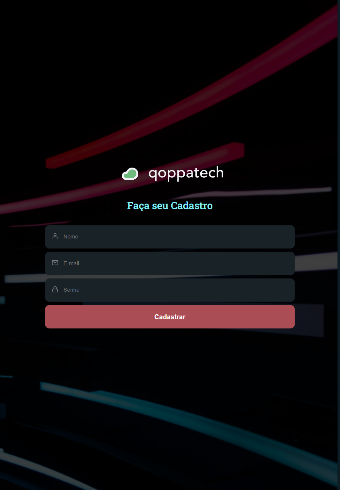
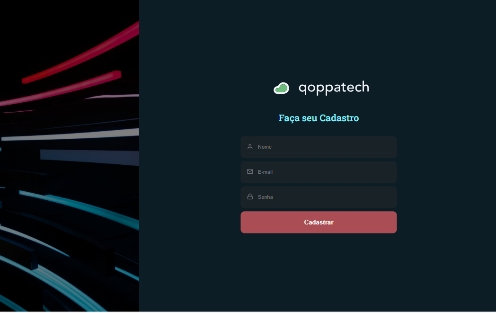

# QoppaTech -> FrontEnds Challenge 

Resultado do teste proposto pela Qoppatech a partir da realização de uma página de cadastro de usuários.

Foram utilizadas as seguintes bibliotecas: 
-
   - Zod: para validação e o tratamento dos campos de entrada do usuário (nome, email e password);
   - React-hook-form:para facilitar captura de ações do formulário;
   - react-icons: para importação de ícones;

## Responsividade

Protótipo de alta fidelidade realizado no Figma para telas mobile, tablets e web:

<h2>Versão Mobile e Tablets</h2>
  
<h2>Versão Web</h2>
 

